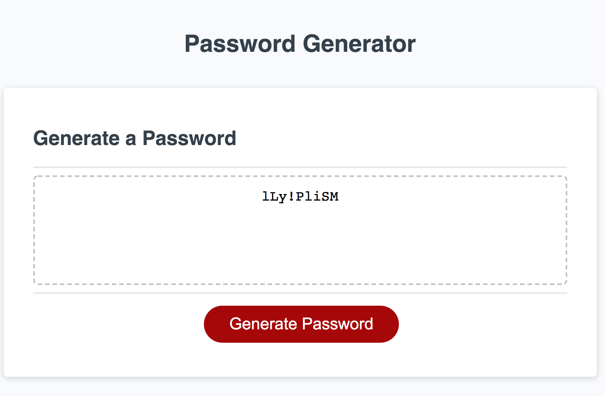

# hw3-password-generator

* This applications generates a strong randome password  that meets certain criteria

## Functionality/Design  

* Clicking generate password button will present a series of prompts for password criteria

    * System will promp you to enter password length between 8 and 128

    * System will prompt you to select character type of the following: 
        * numeric,
        * lowercase, 
        * uppercase, 
        * special characters

* Password should include atlist one character type 

* After all prompts answered password is generated that matches the selected criteria

* Password is generated and displayed to the page

## Mock-Up portfolio

The following image shows password generator appearance and functionality: 

## Links to the deployed application

* URL of the deployed application: https://tewol.github.io/hw3-password-generator/

* URL of the GitHub repository: https://github.com/Tewol/hw3-password-generator

© 2021 Hewan Redie